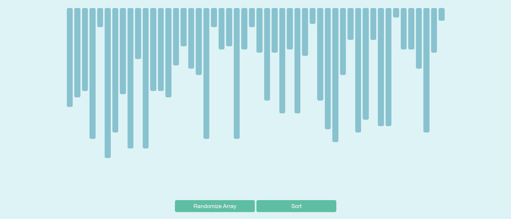
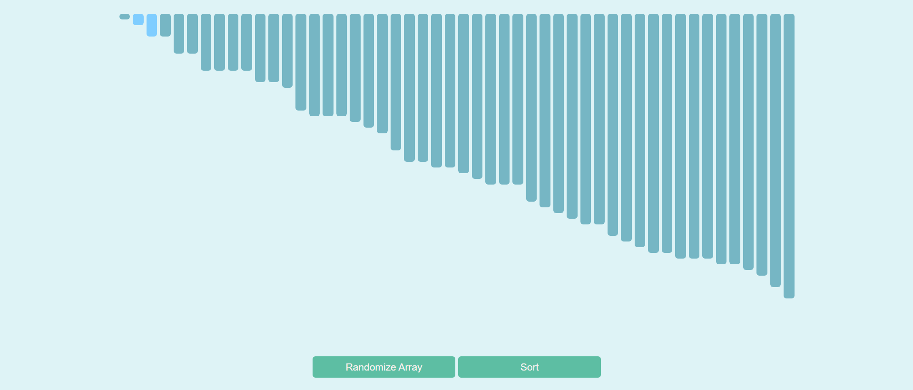

# Sorting Algorithm Visualizer
Allows users to have a visual representation of how various sorting algorithms work.
Currently, only bubble sort is supported, but more sorting algorithms will be added in
the future.

# Features ✨
- Responsive design 📱
- Utilized HTML/CSS/JavaScript 🖥️

# How to Run 🚀
1. Clone this repository: https://github.com/wong-bria/sorting-visualizer.git
2. Open 'index.html' in your browser

# Example Usage
Users can click the "Randomize Array" button to generate a randomized array:

Users can click the "Sort" button to sort the randomized array to visualize how
bubble sort works to sort an unsorted array:

# Motivation behind project: 
After taking a class on Algorithms and Data, and wanting to learn/practice using JavaScript,
I decided to start this personal project to apply the information I learned while learning more
about HTML, CSS, and JavaScript. 